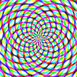

# MathMap language implemented in Rust

This is an implementation of the
[MathMap image processing language](http://www.complang.tuwien.ac.at/schani/mathmap/)
in Rust. MathMap is a nice small scripting language for image filtering and
rendering that was originally designed for use as a GIMP plugin. I thought it
would be a nice target for an hobby interpreter/compiler project, and here we
are.

Click [here](https://nicolov.github.io/mathmap-rs/) for a demo running on your browser with WASM.

Here are some examples of what you can make with it:

<table>
<tbody>
<tr>
<td align="center">
    
</td>
<td align="center">
    
</td>
</tr>

<tr>

<td>

```
filter target ()
    if r % 0.4 < 0.2 then
        rgbColor(1, 0, 0)
    else
        rgbColor(1, 1, 1)
    end
end
```

</td>

<td>

```
filter disco (int red_wavelength: 1-50 (10),
              int green_wavelength: 1-50 (15),
              int blue_wavelength: 1-50 (20),
              float zoom: 0-3000 (500))
    rl = red_wavelength;
    gl = green_wavelength;
    bl = blue_wavelength;
    q = t * 2 * pi;
    rz = r * zoom;
    abs(rgba:[sin(rz/rl+q) + sin(a*rl+q),
              sin(rz/gl+q) + sin(a*gl+q),
              sin(rz/bl+q) + sin(a*bl+q),
              2])
end
```

</td>

</tr>

</tbody>

</table>

## Currently implemented

- Lexer and parser largely inspired by the "Crafting Interpreters" book.
- Rudimentary tree-walking interpreter that can render some examples (both
  stills and animations).
- Function overloading, scalar/vector broadcasting, and (some) built-in
  functions.

## Goals for the bright future

[x] Missing datatypes (complex numbers, matrices, etc..) and language constructs
  (`while`, etc..)
[ ] A semantic analysis pass to resolve fully-qualified types at compile time (for
  type promotion and broadcasting).
[ ] A bytecode compiler + bytecode VM running on the CPU.
[ ] Some kind of GPU compilation target (maybe generating WebGL code, or CUDA PTX,
  or porting the bytecode VM to the GPU?).

## References

- The [MathMap repo](https://github.com/schani/mathmap) where I took the example
  filter scripts.

- [language tutorial](https://www.complang.tuwien.ac.at/schani/mathmap/language.html)

- [language reference](https://www.complang.tuwien.ac.at/schani/mathmap/reference.html)
